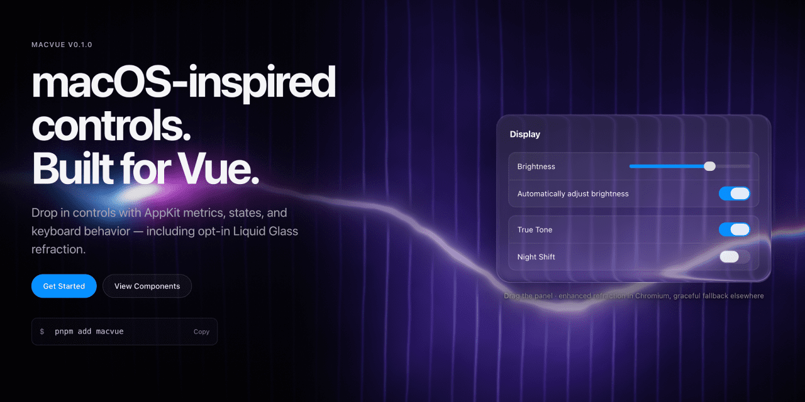
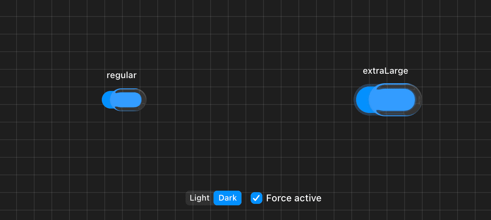

# MacVue

> macOS-inspired controls, built for Vue.



Vue 3 components carrying AppKit metrics, states and keyboard behaviour — including opt-in Liquid Glass refraction.

**Work in progress.** Until 1.0 the design tokens (`--macvue-*` names and scales) are **not a stable contract**: renames and removals may land in minor releases while the library is calibrated against the macOS Tahoe reference.

## What's inside

- **19 components** — Badge, Box, Button, Checkbox, Glass Panel, Help Button, Label, Pop-Up Button (with Pull-Down), Progress, Radio Group, Search Field, Secure Field, Segmented Control, Separator, Slider, Spinner, Stepper, Switch, Text Field.
- **Five control sizes** on every control that has them: `mini`, `small`, `regular`, `large`, `extraLarge` — the `NSControl.ControlSize` scale, measured rather than guessed.
- **Light and dark** through a single `data-macvue-appearance` attribute, on any element rather than just the page root.
- **System accents** — every control follows `--macvue-accent`.
- **Liquid Glass** with real edge refraction, opt-in per subtree and never at the cost of a broken control where it is unsupported.
- **TypeScript types** included. 25 kB gzipped for the whole library, JS and CSS together.

## Installation

```bash
pnpm add @macvue/core
```

Vue 3.4 or newer is a peer dependency.

## Usage

```vue
<script setup lang="ts">
import { MacButton, MacSwitch } from '@macvue/core'
import { ref } from 'vue'
import '@macvue/core/style.css'

const wifi = ref(true)
</script>

<template>
  <MacSwitch
    v-model="wifi"
    aria-label="Wi-Fi"
  />
  <MacButton variant="prominent">
    Continue
  </MacButton>
</template>
```

Import `macvue/style.css` once, at your application entry.

## Appearance

Light and dark are driven by one attribute, and it works on any element — a dark panel inside a light page needs no extra wiring:

```vue
<template>
  <div data-macvue-appearance="dark">
    <MacButton>Cancel</MacButton>
  </div>
</template>
```

The accent colour is a token, so one declaration re-tints every control under it:

```css
.my-app {
  --macvue-accent: #bf5af2;
}
```

## Liquid Glass

Glass surfaces ship a CSS material by default. Edge refraction is opt-in: add `data-macvue-glass="on"` to an ancestor, and the nearest `data-macvue-glass` boundary wins, so a nested `off` disables it locally.

Controls take part too: Switch and Slider grow a refracting lens around the knob while it is held, at every size.

<p align="center">
  
</p>

```vue
<template>
  <div data-macvue-glass="on">
    <MacSwitch
      v-model="wifi"
      size="extraLarge"
      aria-label="Wi-Fi"
    />
    <MacGlassPanel material="clear">
      <span>Media controls</span>
    </MacGlassPanel>
  </div>
</template>
```

Refraction is built on an SVG displacement filter applied through `backdrop-filter`, which currently limits it to Chromium — [WebKit bug 245510](https://bugs.webkit.org/show_bug.cgi?id=245510) is still open. Support is feature-detected at runtime: Safari and Firefox get the CSS material fallback, `prefers-reduced-transparency` gets an opaque surface, and forced colors gets system colors. The control is never hidden while the check runs.

## Documentation

The site is not deployed yet. Run it locally:

```bash
pnpm install
pnpm docs:dev
```

## Development

```bash
pnpm install
pnpm build       # build the macvue package
pnpm play        # playground
pnpm docs:dev    # documentation site
pnpm test        # unit tests
pnpm test:browser # interaction tests (Playwright, Chromium)
pnpm lint
pnpm typecheck
```

## License

[MIT](./LICENSE)

MacVue is an independent open source project and is not affiliated with, endorsed by, or sponsored by Apple Inc. macOS and AppKit are trademarks of Apple Inc.

Copyright (c) 2026-present, [Anton Reshetov](https://github.com/antonreshetov).
